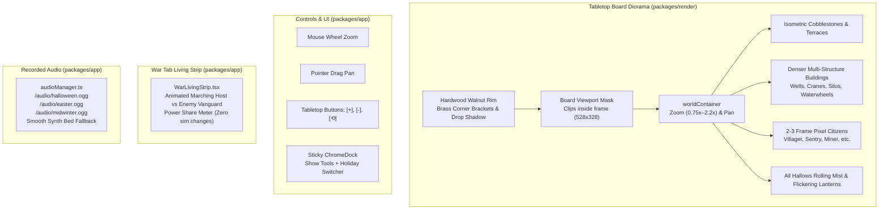

# Gemini Tabletop Board Presentation — Walkthrough

**Branch:** `bakeoff/gemini-board`  
**Pull Request:** [#8 on KyoshiCodes/second-crown](https://github.com/KyoshiCodes/second-crown/pull/8) (Open, unmerged)  
**Invariants Check:** `git diff main -- packages/sim server` is completely empty.

---

## What Was Accomplished

We transformed the visual diorama of **Second Crown** into a tabletop board presentation with responsive camera controls, dense pixel town architecture, discrete walker animation keyframes, an animated War tab battle visualizer, and authentic recorded holiday audio.



---

## Detailed System Changes

### 1. Tabletop Board Frame & Viewport Clipping
- **Hardwood Board Rim**: Rendered a 16px beveled polished dark walnut timber frame around the canvas perimeter with mitered 45° corner seams, antique brass corner plates (`#c8963e`), steel rivets, and an inner recessed drop shadow falling onto the diorama.
- **Viewport Masking**: A Pixi `boardMask` clips all contents of `worldContainer` to `[16, 16, 528, 328]`. Panning or zooming elements smoothly disappear under the wooden rim rather than bleeding past the board edge.

### 2. Zoom and Pan Controls (No Rotate)
- **Mouse Wheel Zoom**: Smooth cursor-centered zooming between `0.75x` and `2.2x`.
- **Drag Panning with Bounds**: Click-and-drag panning bounded within comfortable limits so the hold can never be dragged off-screen.
- **Drag vs. Click Disambiguation**: Pointer movement `< 6px` is registered as a deliberate tile click, preserving 100% building placement and upgrading accuracy without accidental placement during camera movements.
- **Accessible Tabletop Overlay Buttons**: Overlaid `[+]`, `[-]`, and `[⟲]` (reset view to 1.0x center) on the map canvas.

### 3. Denser Pixel Architecture
Upgraded all building types in [`packages/render/src/index.ts`](file:///c:/Projects/second-crown-gemini/packages/render/src/index.ts) from simple shapes into dense multi-structure architectural vignettes:
- **Farm**: Thatched farmhouse with exposed timber beams + brick chimney with curling smoke + stone water well with bucket + fenced vegetable patch (cabbages & pumpkins) + golden hayrick.
- **Lumber Camp**: Notched log cabin + woodcutter's open shelter with chopping block & steel axe + twin spruce pine trees + stacked cords of firewood.
- **Quarry**: Terraced granite quarry pit with chisel tool marks + wooden A-frame crane with hoist cable & stone block + dressed ashlar stacks + wooden wheelbarrow.
- **Mason**: Ashlar stone atelier with arched workshop door + sculptured classical urns + marble pillar pedestals.
- **Gold Mine**: Timbered adit portal + rail tracks + iron ore cart heaped with glittering gold nuggets + wash sluice trough.
- **Mint**: Reinforced stone treasury vault with gold crown pediment + iron-banded security doors + mechanical flywheel coin press + bullion stacks.
- **Granary**: Twin stone brick grain silos with conical roofs + timber gantry hoist with suspended grain sack + barrels of milled flour.
- **Sawmill**: River timber mill shed + spinning wooden waterwheel with water foam + outdoor log carriage track with high-speed buzzsaw blade.
- **Market**: 3-canopy grand bazaar (crimson, gold, and cobalt stripes) + fruit crates + woven bread baskets + spice sacks.
- **Barracks**: Garrison keep with crenellated battlements + iron portcullis + waving heraldic war banner + courtyard training dummy & weapon racks.
- **Stables**: Broad gabled equestrian barn + open stalls + hayloft dormer + stone water trough filled with water.
- **Archery Range**: Shaded archer pavilion + round straw target butts with painted bullseyes and stuck arrows.
- **Siege Workshop**: Heavy stockade yard + rigged catapult with spoked wheels & counterweight + pyramid stack of stone boulder ammunition.
- **Watchtower**: Soaring 3-stage stone tower + overhanging timber hoarding + iron beacon brazier with dancing flame + royal pennant.
- **Chapel**: Gothic cathedral sanctuary + rose stained glass window + bell tower spire with golden cross + cloister garden with stone markers.
- **Walls**: Massive stone curtain wall + projecting bastion tower + battlements and wall torches.
- **Visual Upgrades**: Higher building levels scale vertical height (`(lvl - 1) * 3`) and display gold level indicator studs on their foundations.

### 4. 2–3 Frame Walker Sprites
- Replaced continuous floating-point math with discrete integer-pixel keyframes:
  - **Frame 0 (Neutral / Pass)**: Torso baseline, legs aligned, tool at rest.
  - **Frame 1 (Left Step)**: Torso dips 1px, left leg forward +2px, right leg back -2px, tool swings.
  - **Frame 2 (Right Step)**: Torso dips 1px, right leg forward +2px, left leg back -2px, tool swings.
- 6 distinct citizen roles (Villager with bread basket, Woodcutter with axe, Miner with pickaxe, Merchant with travel pack, Sentry with spear and waving pennant, Scholar with parchment scroll).

### 5. All Hallows Atmosphere (Original Fog & Lantern Flicker)
- **Creeping Mist/Fog**: Low-lying translucent mist banks drifting gently across the cobblestones and buildings.
- **Flickering Lanterns**: Doorsteps feature carved Jack-o'-lanterns with non-uniform organic flicker math (`0.72 + sin(8.5*t)*0.16 + sin(14.3*t)*0.12`) and ground light cast halos.
- **Authentic Backdrop**: Spooky gothic folklore backdrop with giant harvest moon, haunted castle silhouette, and gnarled trees (strictly no Disney likenesses).

### 6. War Tab Living Pixel Unit Strip
- Created [`packages/app/src/WarLivingStrip.tsx`](file:///c:/Projects/second-crown-gemini/packages/app/src/WarLivingStrip.tsx) and embedded it into [`packages/app/src/WarRoom.tsx`](file:///c:/Projects/second-crown-gemini/packages/app/src/WarRoom.tsx).
- Displays player companies lined up on the left with animated 2-3 frame soldiers, an animated royal standard bearer, opposing enemy vanguard on the right, and a real-time power share percentage meter.
- Strictly presentation-only: reads `state.units`, `state.wars`, and `realmPower`. Zero combat simulation changes.

### 7. Recorded Audio Playback
- Updated [`packages/app/src/themes/audioManager.ts`](file:///c:/Projects/second-crown-gemini/packages/app/src/themes/audioManager.ts) and [`packages/app/src/main.tsx`](file:///c:/Projects/second-crown-gemini/packages/app/src/main.tsx) to play recorded tracks (`/audio/halloween.ogg`, `/audio/easter.ogg`, `/audio/midwinter.ogg`) when present.
- Hooked `audioManager.start()` to user clicks/keys to satisfy browser autoplay requirements.
- Suppresses procedural synth melody when recorded music is active; falls back to procedural synth smoothly when tracks are missing.
- Sticky ChromeDock (`zIndex: 120`) remains intact for instant holiday switching.

---

## Verification Results

### Automated Vitest Suite (`packages/sim`)
```
 RUN  v2.1.9 C:/Projects/second-crown-gemini/packages/sim

 ✓ src/systems/levy.test.ts (1 test)
 ✓ src/systems/decree.test.ts (2 tests)
 ✓ src/actions/trade.test.ts (2 tests)
 ✓ src/systems/quest.test.ts (2 tests)
 ✓ src/systems/age.test.ts (5 tests)
 ✓ src/systems/wave.test.ts (4 tests)
 ✓ src/content/world.test.ts (5 tests)
 ✓ src/actions/diplomacy.test.ts (2 tests)
 ✓ src/actions/war.test.ts (2 tests)
 ✓ src/systems/raid.test.ts (2 tests)
 ✓ src/actions/build.test.ts (3 tests)
 ✓ src/offline.test.ts (2 tests)
 ✓ src/actions/upgrade.test.ts (2 tests)
 ✓ src/systems/combat.test.ts (3 tests)
 ✓ src/core/tickEngine.test.ts (7 tests)
 ✓ src/systems/court.test.ts (2 tests)
 ✓ src/systems/worldClash.test.ts (1 test)
 ✓ src/systems/events.test.ts (1 test)

 Test Files  18 passed (18)
      Tests  48 passed (48)
```

### Production App Build (`@second-crown/app`)
```
npm run build -w @second-crown/app
✓ 829 modules transformed.
dist/index.html                   1.50 kB │ gzip:   0.73 kB
dist/assets/index-BQ5uZNXT.css    8.46 kB │ gzip:   2.44 kB
dist/assets/index-XtsJP16y.js   339.87 kB │ gzip: 104.82 kB
dist/assets/pixi-BVz24Imj.js    501.21 kB │ gzip: 143.35 kB
✓ built in 4.30s
```

### Invariant & Boundary Integrity
- `git diff main -- packages/sim server` returned empty (0 changes).
- Pushed clean branch `bakeoff/gemini-board` to `origin`.
- Created Pull Request [#8](https://github.com/KyoshiCodes/second-crown/pull/8) into `main` (left unmerged as instructed).
- All documentation files updated in cadence: `docs/HANDOFF.md`, `docs/CHANGELOG.md`, `docs/USER-NOTES.md`, `docs/DEV-NOTES.md`.
